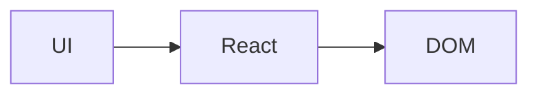

# React18 源码解析之不同的阶段

> 我们解析的源码是 React18.1.0 版本，请注意版本号。React 源码学习的 GitHub 仓库地址：[https://github.com/wenzi0github/react](https://github.com/wenzi0github/react)。

React 是一个声明式的 UI 库，我们通过组件的形式声明 UI，React 会为我们输出 DOM 并渲染到页面上。

在 React 中，对 UI 的声明是通过一种称为 JSX 的语法糖来实现。JSX 在编译时会被 Babel 转换为 React.createElement 方法。

React 中主要会经历 3 个阶段：

1. schedule 阶段：每个任务的优先级是不一样的，如用户触发的任务优先级最高，应当优先执行，对于异步任务可以延迟执行；schedule 阶段为每个触发的任务进行优先级的排序；
2. render 阶段：按照上面阶段设定好优先级，进行 diff 的对比，如是否有可复用的节点、排查出需要删除的节点，需要新增的 fiber 节点等，并且将 jsx 转为 fiber 节点；这个阶段执行完毕后，会出来两个产物，一个是新状态下的 fiber 树，再一个是需要变动节点的链表（如要删除的、新增的、插入的等等）如果是初始化阶段的话，所有的变动都是新增的特性；
3. commit 阶段：按照新整理出来的变动链表进行最小化的更新；这个阶段是不能中断的；

## 1. schedule 阶段

## 2. render 阶段

render 阶段产生变动的节点，并不会在这里直接对 DOM 进行修改，这个阶段只是前后两棵 fiber 树对比，和收集变更的阶段。所有的修改都会在 commit 节点进行。

## 3. commit 阶段

commit 阶段是将上面 render 阶段收集到的所有变动更新到视图上，但最终怎么更新，还需要我们的应用场景。若我们是 web 端，则是通过 react-dom 中的方法转为 dom 节点，其他的还有：

- ReactDOM 渲染到浏览器端
- ReactNative 渲染 App 原生组件
- ReactTest 渲染出纯 Js 对象用于测试
- ReactArt 渲染到 Canvas, SVG 或 VML (IE8)

参考链接：

- https://juejin.cn/post/6844904131795091464#heading-2
