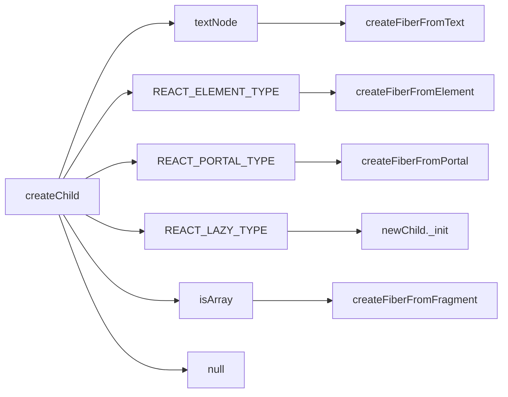

# 将单个不知类型的虚拟dom转为fiber节点

这里用到的方法是ReactChildFiber.old.js中的 createChild() 方法，因为不知道newChild是什么类型，那方法的内部就得判断了。

这相当于入口，判断好类型后，再分别调用不同的方法来创建fiber节点。

```mermaid
graph LR;
  createChild --> textNode
  textNode --> createFiberFromText
  createChild --> REACT_ELEMENT_TYPE
  REACT_ELEMENT_TYPE --> createFiberFromElement
  createChild --> REACT_PORTAL_TYPE
  REACT_PORTAL_TYPE --> createFiberFromPortal
  createChild --> REACT_LAZY_TYPE
  REACT_LAZY_TYPE --> newChild._init
  createChild --> isArray
  isArray --> createFiberFromFragment
  createChild --> null
```

