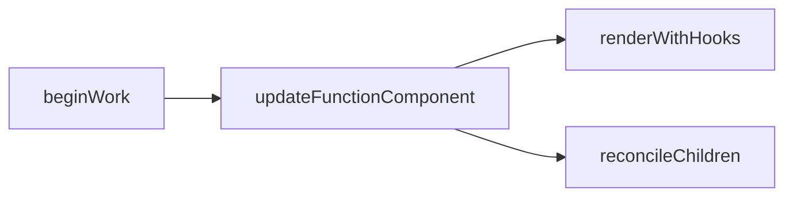
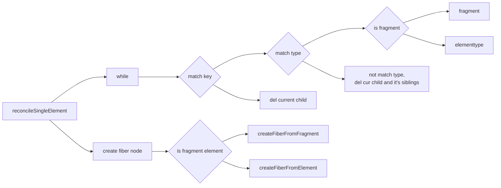

# 如何将虚拟 dom 转为 fiber 结构

从 React17 开始，



在 upateFunctionComponent() 中最主要会执行两个方法 renderWithHooks() 和 reconcileChildren()。 renderWithHooks() 里会根据 current 和 current.memoizedState 判断当前是初始化，还是更新。

这里我们主要讲 reconcileChildren() 。

这里会执行到 reconcileChildren() 方法，然后根据 current 是否为 null，来决定是初始化 fiber 树，还是更新 fiber 树，即要执行 mountChildFibers()还是 reconcileChildFibers()。

两者的区别在于要追踪副作用，比如一些 hook 的更新等等。初始 fiber 树时，不用跟之前的 fiber 树对比，只需要初始化下 hook，用初始化的 hook 值来构建 fiber 树即可。而更新 fiber 树时，新 workInProgress 需要与目前的 current 树进行对比，找出需要更新的 fiber 节点，这里调用 reconcileChildFibers() 。

```javascript
export const reconcileChildFibers = ChildReconciler(true);
export const mountChildFibers = ChildReconciler(false); // 是否要追踪副作用，初始化时不用追踪
```

执行`ChildReconciler()`得到的是 reconcileChildFibers() 方法，这里面会判断每个节点的类型（如普通的 REACT_ELEMENT_TYPE 类型，字符串类型，fragment 类型，数组类型等），然后分别调用不同的方法创建该节点。

reconcileChildFibers 最终的返回是当前节点的第一个孩子节点，会在 performUnitWork 中 return 并赋值给 nextUnitOfWork。

[ReactChildFiber.old.js](packages/react-reconciler/src/ReactChildFiber.old.js)

## newChild 的类型

我们先来看下源码 reconcileChildFibers() 中都判断了 newChild 的哪些类型：

1. 是否是顶层的 fragment 元素，如在执行 render()时，用的是 fragment 标签（<></> 或 <React.Fragment></React.Fragment>）包裹，则表示该元素顶级的 fragment 组件，这里直接使用其 children；
2. 合法的 ReactElement，如通过 createElement、creatPortal 等创建创建的元素，只是\$\$typeof 不一样；这里也把 lazy type 归类到了这里；
3. 普通数组，每一项都是合法的其他元素；
4. Iterator，跟数组类似，只是遍历方式不同；
5. string 或 number 类型：如(<div>abc</div>)里的 abc 即为字符串类型的文本；

## 单个普通的 ReactElement

若 newChild 是普通的 ReactElement，则调用 reconcileSingleElement()。我们看下这个函数里是如何操作的。

根据将要构建的元素的 key 和节点类型，这里用循环查找第一个 key 和节点类型都一样的节点，进行复用。若找到了则复用该节点，同时删除该节点的兄弟节点（和该兄弟节点的所有兄弟节点）；若没找到，则删除当前节点和兄弟节点，新创建一个。（其实这里并没有直接删除，而是把将要删除的元素放到了 returnFiber 的 deletions 副作用节点上，在下次渲染之前才进行删除）

> 为什么使用循环进行匹配？
> 新节点是单个节点，但无法保证之前的节点也是单个节点。

这里也有不少的判断逻辑：



```shell
while
  若key先匹配上了
    节点类型匹配上
      若节点类型是fragment
        1. 删除当前元素的兄弟元素，和该兄弟元素的所有兄弟元素
        2. 复用现在的child和将要构建的children(fragment类型的只有children有用)，复制合并到 workInProgress 上
        3. 新fiber节点的return指针指向到returnFiber节点上
      若节点是其他类型
        上面的3点都会执行，还会单独特殊处理下ref
    类型没有匹配上
      删除现在的child和其所有的兄弟元素，break
  key没匹配上
    删除当前元素

无法复用，创建新节点
  fragment类型
    执行 createFiberFromFragment()
  其他类型
    执行 createFiberFromElement()
      createFiberFromTypeAndProps()，判断element.type的类型，然后调用不同的方法，进行创建
    处理ref
    新fiber节点的return指针指向到returnFiber节点上
```
